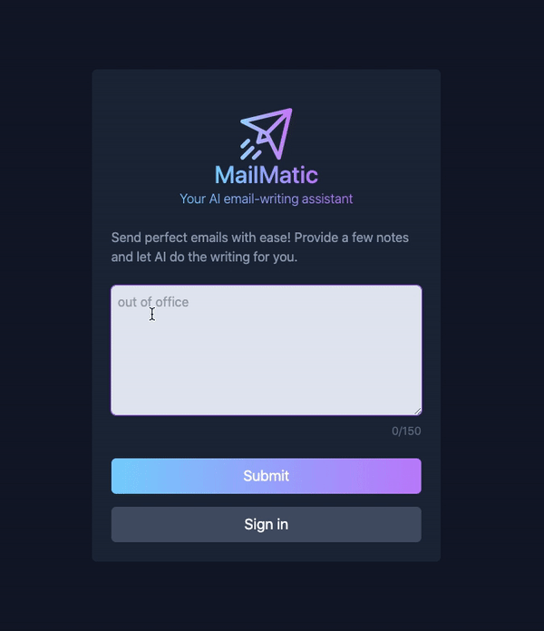
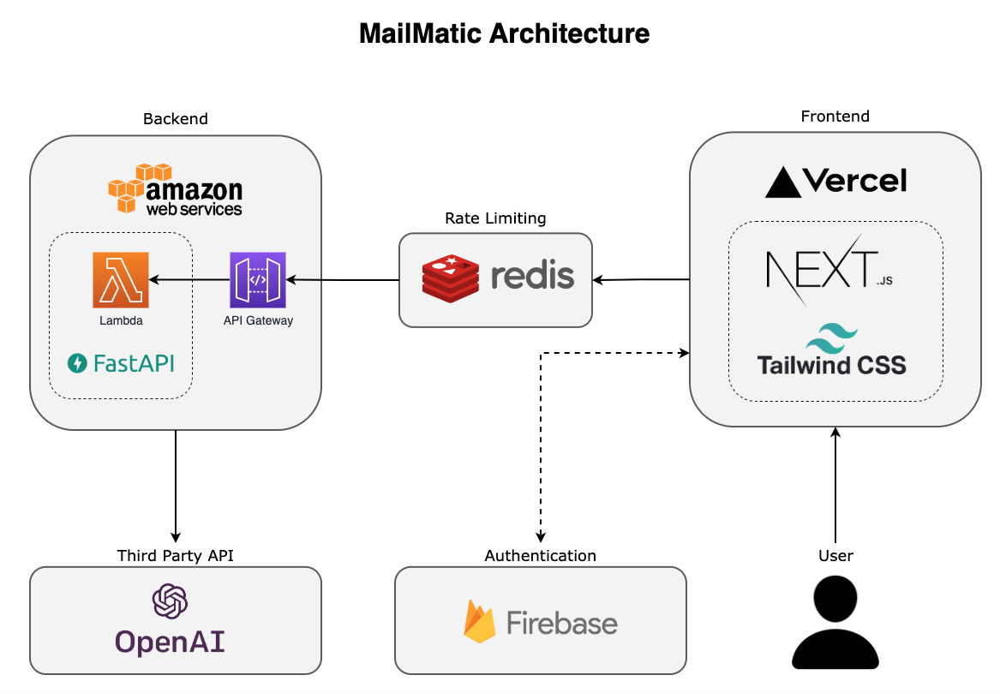

# [MailMatic](https://mailmatic.vercel.app/)

MailMatic is a simple web app that helps you write perfect emails with ease. Submit a few notes and the AI will write an email for you.

Users without an account can submit notes of up to 150 characters, while registered users can submit notes of up to 300 characters. Additionally, users are limited to a maximum of five submissions per hour.

A demo can be viewed below. To access the application, click on this link: [mailmatic.vercel.app](https://mailmatic.vercel.app/).



## Technology stack

Under the hood MailMatic is running [OpenAI's GTP-3 model Davinci](https://beta.openai.com/docs/models/gpt-3). The interactions with Davinci are handled by a serverless AWS backend written in Python. The frontend is built with [NextJS](https://nextjs.org/) and [TailwindCSS](https://tailwindcss.com/) written in Typescript and is hosted on [Vercel](https://vercel.com/dashboard). User authentication is handled via [Firebase](https://firebase.google.com/). Rate limiting is implemented using [Redis](https://redis.com/).



## Running locally

In order to run the project locally, you will need:

- OpenAI API key
- AWS account
- [AWS CDK](https://aws.amazon.com/cdk/) set up
- Docker running
- Firebase account
- Redis DB

Put the respective credentials in a `.env` file analogous to `backend/.example.env` and `mailmatic-site/.example.env`.

Now you need to set up the backend infrastructure in AWS. First, generate base layer for AWS Lambda.

```
cd backend/infra/lambda_base_layer
chmod -x generate_base_layer.sh
./generate_base_layer
```

This should create a `layer.zip` file. Then deploy the stack.

```
cdk deploy
```

Once the AWS infrastructure has been set up, you can run the application and it will be available at `http://localhost:3000`

```
cd mailmatic-site
npm run dev
```

## Special thanks

A big thank you to [@pixegami](https://github.com/pixegami) for the helpful tutorials. Your videos helped me tremendously in this project.
